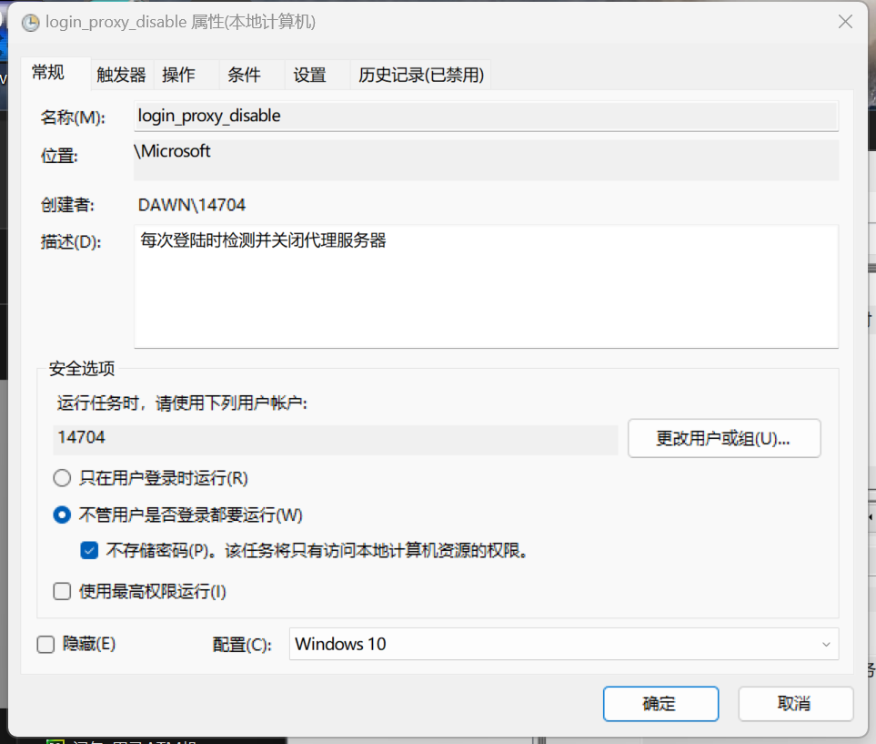

# 开机时自动检测并关闭代理服务器

## 问题描述：

- 代理服务器使用者有时会遇到浏览器无法正常使用的情况
- 这是因为在关闭电脑前没有手动退出clash，导致下次登陆时代理服务器处于开启状态，但clash未打开，因此浏览器访问不正常

## 解决

1. 以Windows为例，我写了一个批处理脚本实现每次开机时自动关闭代理服务器，脚本已经放在github同目录下。代码如下：
    ```batch
    @echo off
    setlocal
    
    reg query "HKCU\Software\Microsoft\Windows\CurrentVersion\Internet Settings" /v ProxyEnable | findstr "REG_DWORD" >nul
    if %errorlevel% equ 0 (
        reg add "HKCU\Software\Microsoft\Windows\CurrentVersion\Internet Settings" /v ProxyEnable /t REG_DWORD /d 0 /f
        echo Proxy server has been disabled.
    ) else (
        echo Proxy server is already disabled.
    )
    
    endlocal
    exit
    ```
2. 在电脑的任务计划程序中设置每次登录时运行该脚本
   1. Win+R输入taskschd.msc打开任务计划程序设置
   2. 点击 **任务计划程序库->Microsoft->创建基本任务**，任务触发器选择系统启动时
   3. 属性页可进行调整（不强制），如下：
   
   

参考博客：[windows定时任务的查看、取消、启动和创建](https://blog.csdn.net/xijinno1/article/details/135877431)